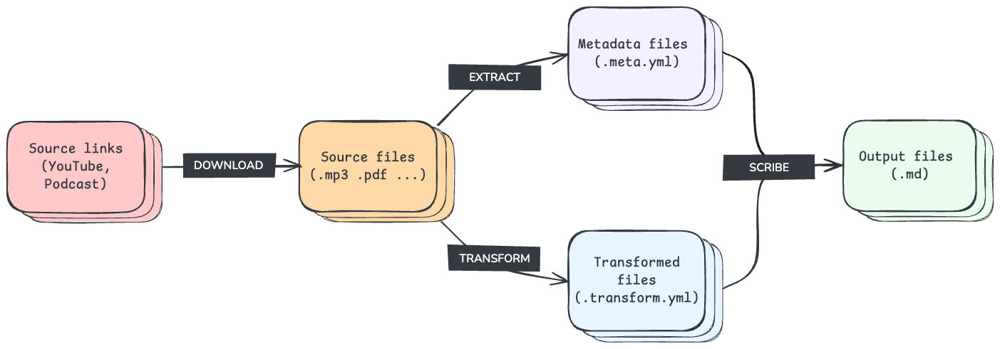

# Charmina

Yet another CLI tool and python package to transform your raw content into Markdown format optimized for AI consumption.

## Table of Contents
- [Charmina](#charmina)
  - [Table of Contents](#table-of-contents)
  - [Introduction](#introduction)
  - [Requirements](#requirements)
  - [Quick Start](#quick-start)
  - [How to Use?](#how-to-use)
  - [Create and Manage Projects](#create-and-manage-projects)
  - [Run Pipeline Stages](#run-pipeline-stages)
    - [Download](#download)
    - [Extract](#extract)
    - [Transform](#transform)
    - [Scribe](#scribe)
  - [Configuration with Environment Variables](#configuration-with-environment-variables)
  - [License](#license)

## Introduction

Charmina is a document processing tool that makes AI content preparation simple. It transforms YouTube videos, podcasts, and raw documents into AI-ready Markdown files, optimized for embedding calculations in AI chat systems and RAG applications. The process is divided into 4 stages: **download**, **extract**, **transform** and **scribe**.



Key features:
- **Multi-source Support**: Process content from various sources including YouTube videos, podcasts and local documents in different formats (mp3, pdf, txt, md, etc).
- **Audio Transcription**: Built-in support for audio transcription using Whisper models.
- **PDF Transcription**: Built-in support for PDF transcription using Marker package.
- **Project Management**: Organize content by topic within project workspaces, each with its own sources, configuration and templates.
- **Pipeline Architecture**: Structured processing pipeline with stages for downloading, extracting, transforming, and scribing content.

## Requirements

Before installing Charmina, make sure you have:

- Python >=3.10
- (Optional) OpenAI API key

Install the package:
```bash
pip install git+https://github.com/raulonlab/charmina.git
```

For development:
```bash
git clone https://github.com/raulonlab/charmina.git
poetry install
poetry shell
```

## Quick Start
```bash
# Install the package or add it to your environment
pip install git+https://github.com/raulonlab/charmina.git

# Create and activate a project
charmina project create my_first_project
charmina project activate my_first_project

# Add some YouTube URLs to youtube.sources
echo "https://www.youtube.com/watch?v=..." >> _projects/my_first_project/youtube.sources

# Add some .pdf files to the project's sources directory
cp my_document.pdf _projects/my_first_project/sources/my_document.pdf

# Run the pipeline
charmina run download
charmina run extract
charmina run transform
charmina run scribe
```

## How to Use?

```bash
charmina --help
```

```bash
Usage: charmina [OPTIONS] COMMAND [ARGS]...

╭─ Options ──────────────────────────────────────────────────╮
│ --install-completion          Install completion for the   │
│                               current shell.               │
│ --show-completion             Show completion for the      │
│                               current shell, to copy it or │
│                               customize the installation.  │
│ --help                        Show this message and exit.  │
╰────────────────────────────────────────────────────────────╯
╭─ Commands ─────────────────────────────────────────────────╮
│ env       Print the current value of environment variables │
│ config    Print the active project configuration           │
│           (charmina.config.yml)                            │
│ project   Manage projects: create, activate, deactivate,   │
│           list and remove                                  │
│ run       Run pipeline stages: download, extract,          │
│           transform and scribe                             │
╰────────────────────────────────────────────────────────────╯
```

## Create and Manage Projects

Create a new project:
```bash
charmina project create project_name
```
> Note: Charmina automatically creates a `_projects` directory in your current path to store all the project's data.

Each project has the following structure:
```
📁 _projects/
├─ 📁 project_name/
│  ├─ 📁 charmina_output/       # Processed Markdown files ready for AI consumption
│  ├─ 📁 charmina_sources/      # Raw files to transform (mp3, pdf, txt, etc)
│  │  ├─ 📁 youtube/            # Downloaded YouTube content (mp3)
│  │  └─ 📁 podcasts/           # Downloaded podcast content (mp3)
│  ├─ 📄 charmina.config.yml    # Project-specific configuration
│  ├─ 📄 charmina.prompts.yml   # Custom LLM prompts for content processing
│  ├─ 📄 charmina.templates.yml # Output file templates
│  ├─ 📄 podcast.sources        # List of podcast feed URLs
│  └─ 📄 youtube.sources        # List of YouTube URLs (channels, playlists, videos)
```

Manage your projects with these commands:
```bash
charmina project activate project_name  # Set as active project
charmina project list                   # Show all projects
charmina project rename old_name new_name  # Rename project
charmina project remove project_name      # Remove project
```

When you activate a project, Charmina saves it as `ACTIVE_PROJECT=project_name` in `.charmina.env`. All subsequent commands will use this project's configuration and source files.

## Run Pipeline Stages

There are 4 stages in the pipeline that you can run individually:

```bash
charmina run download  # Downloads all sources
charmina run extract  # Extract text from downloaded content
charmina run transform  # Transform extracted text into Markdown
charmina run scribe  # Scribe Markdown content into AI-ready format
```

See the available arguments and options for each command adding the `--help` flag:

### Download

Download audio files of YouTube videos and podcasts specified in your project's sources files:

- `youtube.sources`: Links to YouTube videos, playlists and channels.
- `podcast.sources`: Links to Podcast XML feeds.

Downloaded files are stored in their respective directories `sources/youtube/` and `sources/podcasts/`.

You can configure download behavior through environment variables (see Configuration section below):

### Extract

The extract stage searchs for source files in the `sources/` directory to extract metadata and content.

Files are processed in parallel (up to 4 workers) with these steps:
1. Extract metadata (title, description, duration, etc.)
2. Optionally refine descriptions using LLM to clean up timestamps, links, and promotional content (prompts can be customized in `charmina.prompts.yml`)
3. Saves metadata content alongside the source file with extension `.metadata.yml`.

The metadata file also includes a default configuration for the transformtion stage that you can edit manually to customize the transform process (ie: page range, chapters, etc.).

### Transform

The transform stage converts source files in the `sources/` directory into text content.

For each source file, the transform stage:
1. Loads the metadata from the `.metadata.yml` file
2. Applies the appropriate transformer based on file type and per-source configuration in the `.metadata.yml` file:
   - Audio files (`.mp3`, `.mp4`) → Whisper transcription
   - PDF files → Marker text extraction
   - Text files (`.txt`, `.md`) are passed through without modification
3. Saves the transformed content alongside the source file with extension `.transform.yml`

⚠️ Audio transcription can be resource-intensive, so files are processed sequentially by default.

Some parameters are customizable through project configuration (see [./charmina/charmina.config.yml](./charmina/charmina.config.yml)):
- Whisper model and package for audio transcription
- PDF extraction settings
- Processing parameters

### Scribe

The scribe stage merges the transformed content with the metadata to create AI-ready Markdown files.

For each source file, the scribe stage:
1. Loads the transform `.transform.yml` and metadata `.metadata.yml` files
2. Renders the output Markdown using Jinja templates (templates can be customized in `charmina.templates.yml`)
3. Saves the Markdown file in the output directory `/projects/project_name/output/`

⚠️ The scribe stage is currently experimental and may not work as expected for all content types.

Some parameters are customizable through project configuration (see [./charmina/charmina.config.yml](./charmina/charmina.config.yml)):

## Configuration with Environment Variables

You can adjust the application's general behavior using environment variables, either directly or by specifying them in an optional `.env` file located in the current directory.

To view the current set of environment variables, use the command:
```bash
charmina env
```

The available variables with their default values are:

```ini
# general options
PROJECTS_DIRECTORY_PATH=_projects  # (Default: "_projects") Path to projects directory
# LOG_FILE_LEVEL=  # (Default: None) Logging level for the log file. Values: INFO, WARNING, ERROR, CRITICAL, NOTSET. If None, disable logging to file
LOG_FILE_PATH=logs/charmina.log  # (Default: "logs/charmina.log") Path to log file
VERBOSE=1  # (Default: 1) Amount of logs written to stdout (0: none, 1: medium, 2: full)

# openai
OPENAI_API_KEY=  # (Required) OpenAI API key
OPENAI_ORG_ID=  # (Required) OpenAI Organisation ID

# transcription (Whisper) options
WHISPER_TRANSCRIPTION_MODEL_NAME=base  # (Default: "base") Name of the model to use for transcribing audios: tiny, base, small, medium, large
WHISPER_PACKAGE_NAME=faster-whisper  # (Default: "faster-whisper") Name of the package to use for transcribing audios: faster-whisper, whisper-mps, transformers
TRANSCRIPT_ADD_SUMMARY=False  # (Default: False) Include a summary of the transcription in the output file

# youtube download options
YOUTUBE_DOWNLOAD_TYPE=audio  # (Default: "caption") Type of content to download: caption, audio
YOUTUBE_GROUP_BY_AUTHOR=True  # (Default: True) Group downloaded videos by channel
YOUTUBE_SLEEP_SECONDS_BETWEEN_DOWNLOADS=3  # (Default: 3) Number of seconds to sleep between downloads
YOUTUBE_ADD_DATE_PREFIX=True  # (Default: True) Prefix all episodes with an ISO8602 formatted date of when they were published. Useful to ensure chronological ordering
YOUTUBE_SLUGIFY_PATHS=True  # (Default: True) Clean all folders and filename of potentially weird characters that might cause trouble with one or another target filesystem
YOUTUBE_MAXIMUM_EPISODE_COUNT=30  # (Default: 30) Only download the given number of episodes per youtube channel. Useful if you don't really need the entire backlog. Set 0 to disable limit

# podcast download options
PODCAST_UPDATE_ARCHIVE=True  # (Default: True) Force the archiver to only update the feeds with newly added episodes. As soon as the first old episode found in the download directory, further downloading is interrupted
PODCAST_ADD_DATE_PREFIX=True  # (Default: True) Prefix all episodes with an ISO8602 formatted date of when they were published. Useful to ensure chronological ordering
PODCAST_SLUGIFY_PATHS=True  # (Default: True) Clean all folders and filename of potentially weird characters that might cause trouble with one or another target filesystem
PODCAST_GROUP_BY_AUTHOR=True  # (Default: True) Create a subdirectory for each feed (named with their titles) and put the episodes in there
PODCAST_MAXIMUM_EPISODE_COUNT=30  # (Default: 30) Only download the given number of episodes per podcast feed. Useful if you don't really need the entire backlog. Set 0 to disable limit
PODCAST_SHOW_PROGRESS_BAR=True  # (Default: True) Show a progress bar while downloading
```

The application also stores runtime settings in the `.charmina.env` file, such as the active project configuration. It's not necessary to touch this file, as it is handled automatically by the application.

## License

This project is licensed under the MIT License. See the [LICENSE](LICENSE) file for details.

